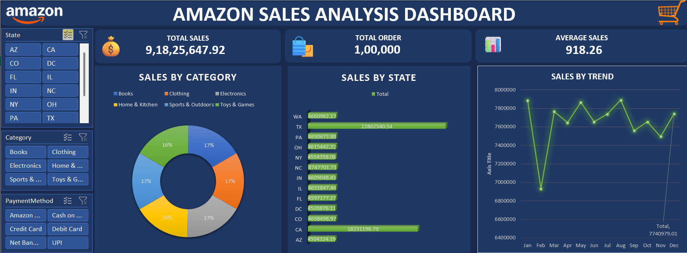

# 📊 Amazon Sales Analysis Dashboard

## 🚀 Project Highlights

✔ Interactive Excel Dashboard  
✔ KPI Cards  
✔ Pivot Tables & Pivot Charts  
✔ Data Cleaning  
✔ Sales Analysis  
✔ Business Insights  
✔ Python Analysis (Pandas)  
✔ Interactive Slicers

---

## 📌 Project Overview

This project analyzes Amazon sales transaction data using Microsoft Excel and Python. The dashboard provides interactive insights into sales performance using KPI cards, Pivot Charts, and slicers. Python was used for data loading, exploration, KPI calculations, and sales analysis.

---

## 🎯 Objectives

- Clean and prepare the dataset.
- Analyze overall sales performance.
- Calculate business KPIs.
- Identify top-performing states and categories.
- Analyze monthly sales trends.
- Build an interactive Excel dashboard.
- Perform basic data analysis using Python.

---

## 🛠️ Tools & Technologies

- Microsoft Excel
- Python
- Pandas
- Matplotlib
- Jupyter Notebook
- Pivot Tables
- Pivot Charts
- Slicers

---

## 📊 Dashboard Features

### KPI Cards

- Total Sales
- Total Orders
- Average Sales

### Interactive Slicers

- State
- Category
- Payment Method

### Charts

- Sales by State
- Sales by Category
- Monthly Sales Trend

---

## 📈 Key Analysis

- Total Sales Analysis
- State-wise Sales
- Category-wise Sales
- Monthly Sales Trend
- Interactive Dashboard Filtering

---

## 📂 Project Files

- Amazon_dashboard.xlsx
- Amazon_dataset.xlsx
- Amazon_sales.ipynb
- dashboard.png

---

## 📷 Dashboard Preview

---

## 💡 Business Insights

- Compared sales performance across different states.
- Identified the highest-selling product categories.
- Analyzed monthly sales trends.
- Enabled interactive dashboard filtering with slicers.

---

## 🎯 Project Outcome

This project demonstrates the use of Microsoft Excel and Python to transform raw sales data into an interactive dashboard and meaningful business insights. It highlights dashboard design, KPI reporting, data visualization, and analytical skills required for Data Analyst roles.

---

GitHub: https://github.com/Mariya-Venus

LinkedIn: https://www.linkedin.com/in/mariya-venus67/
